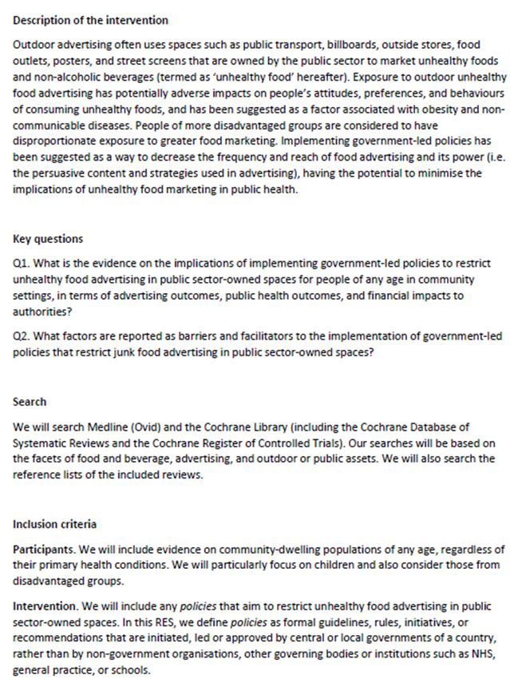

# Developing the RES protocol in collaboration with decision-makers

## Learning objectives

By the end of this section you should:

-   Understand the key components of a RES protocol (or plan)

-   Understand how to formulate decision-makers’ uncertainties into structured, answerable questions

-   Understand the flexible and iterative approach used when considering eligible research for a RES.

## Involving decision-makers in RES planning

It may be relevant to involve decision‑makers in RES planning, depending on who will conduct the RES.

:::: panel-tabset
### If you are commissioned to produce a RES by decision‑makers:

In this case, decision‑makers should be actively involved in RES planning to ensure the RES reflects their needs, priorities, and context. To ensure effective engagement and collaboration with the partners commissioning a RES, it is highly recommended to follow a structured co-production approach. The approach we used in the ARC-GM RES team is below:

-   **Gathering inquiry**

ARC-GM creates a pre-defined [evidence inquiry form template (docx)](forms/Data extraction form template (quant).xlsx) (click the link to download), aiming to gather essential details about their needs and priorities.

-   **Facilitated discussion**

After receiving the completed form, we meet with the decision-makers to review their inquiry and discuss their requirements in greater depth.

These initial discussions focus on gathering more information on the motivating decision problem and key questions that they would like to answer via the RES. These also provide opportunities to clarify what the RES can and cannot do, so as to help manage the expectations of commissioners.

To support a productive meeting with decision-makers, consider the tips below.

::: {.callout-tip collapse="true"}
#### Tips (click to expand)

**Before the meeting**

Brief decision-makers on the RES approach and what it involves, to help support informed engagement.

Clarify that the initial meeting focuses on clarifying the inquiry and planning the RES.

**During the meeting**

We discuss the following with decision-makers:

-   **What is the context of the RES inquiry?**

This discussion helps understand the regional and national context, ensuring that the RES is relevant to the wider system. We explore issues such as:

1.  where the innovations of interest sit within the wider system;

2.  whether any system-level factors are of relevance and why.

-   **What are the innovations?**

We ask the decision-makers to describe the innovations as explicitly as possible (e.g., the components, target population, intended outcomes, delivery setting), and where necessary, we check our understanding to ensure we are working from a shared description.

-   **Our interpretation of the RES questions they asked**

Based on the completed evidence request form, we propose the RES questions. We sense-check with decision-makers about the proposed questions, and as required, we adjust the questions during the meeting and check back to ensure that we accurately reflect their inquiry.

-   **Their existing knowledge**

We encourage decision-makers to share relevant information and documents that may inform RES planning, particularly those not publicly available.

Throughout engagement, we manage the expectations of decision-makers by:

1.  Being honest and transparent about the desired objectives of engagement and what a RES can and cannot do within the available time and resources;

2.  Carefully resolving conflicts between multiple decision-makers and/or between decision-makers and the RES team.
:::

-   **On-going communication**

Ongoing conversation with those requesting a RES is essential to shape a plan that reflects decision-maker needs, and we will share feedback at key stages (e.g., after scoping, after searching/screening, and when emerging information affects the agreed approach).

### If you are producing a RES for your own use:

As you are both the evidence user and the RES producer, you may not need to engage additional decision‑makers.
::::

## Overview of the key components of a RES protocol

Pre-specifying a RES plan is important as it guides how the RES will be conducted. The plan should set out the RES questions and clearly outline the shared understanding of scope. It should also describe methods to be used, whilst recognising that the process is iterative and that elements of the plan may be refined as the size and shape of the available evidence become clearer.

Registration of RES protocols on platforms such as [CRD PROSPERO](https://www.crd.york.ac.uk/prospero/) is not required. It is a recommended practice to keep them internally as an auditable record for the review team and decision-makers.

Most ARC-GM RES protocols include the elements presented in the example plan below, drawn from the [ARC-GM RES Restricting advertising in public spaces](files/ARC-GM RES outdoor advertising harmful commodities.pdf).

:::: cr-section
Scroll down to read the brief explanation of related elements.

::: {#cr-figure1}
{width="550" height="700"}
:::

The **Description of the innovations** section provides a brief context about the motivating decision-making problems. It then gives a description of the innovations of focus. This section commonly ends by outlining how the innovations are suggested to impact on practice. @cr-figure1

When describing the target innovations for the RES, we consider the following factors that influence the adoption and scale-up of the innovation:

1.  What are the characteristics of the innovation or proposed change?

    Such characteristics can include:

    -   The situation(s) or setting(s) where the innovation will be used or introduced (e.g. public spaces, primary care, hospital-based specialist care)

    -   The primary purpose of the innovation (for example, preventive, curative, rehabilitative, long-term care)

    -   The mode of provision (e.g. inpatient, outpatient, day care, home care)

2.  Who will be exposed to the innovation?

3.  If relevant, what is the mechanism by which change will be achieved?

4.  If relevant, what is the strategic, political or environmental context underlying the innovation adoption?

The **Key Questions** section specifies the well-structured and answerable questions that will require evidence synthesis for decision-making.

The RES process involves formulating decision-makers’ inquiries into structured, answerable questions. Decision-makers may have different types of questions they want to explore in a RES, including questions about:

+------------------------------------------------+----------------------------------------------------------------------------------------------------------------+------------------------------------------------------------------------------------------------------------------------------------------------------------------------------------------------------------------------------------------------------------------------------------------------------------------------------------+
| Type of questions                              | Descriptions                                                                                                   | Examples                                                                                                                                                                                                                                                                                                                           |
+================================================+================================================================================================================+====================================================================================================================================================================================================================================================================================================================================+
| Innovation effectiveness                       | This type of question explores whether an innovation ‘works’ in **treating** and/or **preventing** a condition | *What is the evidence for clinically- and cost-effective service delivery interventions for preventing or managing multiple long-term conditions?* (see [ARC-GM RES Multiple long term conditions](files/ARC-GM RES Multiple long term conditions.pdf))                                                                            |
+------------------------------------------------+----------------------------------------------------------------------------------------------------------------+------------------------------------------------------------------------------------------------------------------------------------------------------------------------------------------------------------------------------------------------------------------------------------------------------------------------------------+
| People’s experiences                           | This type of question explores the **experience** of service users or staff                                    | What evidence is available on people’s experience of debt and financial hardship advice and support services in or via primary care settings such as general practice and pharmacy?(see [ARC-GM RES Financial and debt advice in primary care](files/ARC-GM RES Financial and debt advice in primary care.pdf))                    |
+------------------------------------------------+----------------------------------------------------------------------------------------------------------------+------------------------------------------------------------------------------------------------------------------------------------------------------------------------------------------------------------------------------------------------------------------------------------------------------------------------------------+
| Barriers to and facilitators of innovation use | This type of question explores what inhibits and promotes the delivery of the innovation under evaluation      | *What factors are reported as barriers and facilitators for delivery of and access to debt and financial hardship advice and support services in people, particularly those of disadvantaged groups?* (see [ARC-GM RES Financial and debt advice in primary care](files/ARC-GM RES Financial and debt advice in primary care.pdf)) |
+------------------------------------------------+----------------------------------------------------------------------------------------------------------------+------------------------------------------------------------------------------------------------------------------------------------------------------------------------------------------------------------------------------------------------------------------------------------------------------------------------------------+
| Costs                                          | This type of question explores whether an innovation provides good value for what it costs                     | *What is the evidence for clinically- and cost-effective service delivery interventions for preventing or managing multiple long-term conditions?* (see [ARC-GM RES Multiple long term conditions](files/ARC-GM RES Multiple long term conditions.pdf))                                                                            |
+------------------------------------------------+----------------------------------------------------------------------------------------------------------------+------------------------------------------------------------------------------------------------------------------------------------------------------------------------------------------------------------------------------------------------------------------------------------------------------------------------------------+
| Diagnosis                                      | This type of question explores how well a test diagnoses someone with a condition                              | *What is the measurement performance of remote spirometry compared with spirometry performed in a clinical or laboratory setting? a) For patients with suspected or diagnosed asthma? b) For patients with suspected or diagnosed COPD?* (see [ARC-GM RES Remote Spirometry](files/ARC-GM RES Remote Spirometry.pdf))              |
+------------------------------------------------+----------------------------------------------------------------------------------------------------------------+------------------------------------------------------------------------------------------------------------------------------------------------------------------------------------------------------------------------------------------------------------------------------------------------------------------------------------+

The PICO framework can help in framing a RES question, especially when it relates to effectiveness. See **Section 2.5** for other frameworks that can be used in framing other questions. 

The **Search** section outlines resources to be searched, key concepts we use to search (or a search strategy that will be followed), and/or other resources we use in addition to database searches.

The **Eligibility Criteria** section lists the key criteria for included studies, with sufficient details, that can define what evidence will be considered eligible for inclusion. If applicable, the eligibility criteria can be structured by the following elements: **Participants**; **Interventions**; **Comparators**; **Outcomes**; and **Study design**.

As with most reviews, the review question shapes the eligibility criteria of the RES. Howerver, compared with a typical systematic review, the RES process allows for more flexibility for adaptation, meaning that the eligibility criteria may be modified once the nature and the amount of the available evidence become clearer. This is informed by an adaptive process of searching and study selection.

Modifying the eligibility criteria for a RES may be expected and can often happen, particularly when decision-makers have questions about novel innovations for which there is little or no existing research about them for the populations of interest. In these circumstances, whilst we often start with a focused approach in a RES and consider evidence that is **directly relevant** to a question, where we find the available evidence is sparse, outdated, or little, we may broaden the eligibility criteria to look for **indirectly relevant evidence**. Direct evidence comes from studies that match the RES question closely, i.e., directly comparing the innovations of interest among specific populations in the context described by the RES question. Indirect evidence does not perfectly match the specific population, innovation, context, or outcome of interest but may provide useful insights relating to a wider or analogous focus (see example scenarios below).

Decision-makers play a key role in clarifying the types of innovation, context, and/or outcomes that are considered directly and indirectly relevant.

Evidence could be considered **indirectly relevant** under the following scenarios:

+------------------------------------+----------------------------------------------------------------------------------------------------------------------------------------------------------------------------------------------------------------------------------------------------------------------------------------------------------------------------------------------------------------+-------------------------------------------------------------------------------------------------------------------------------------------------------------------------------------------------------------------------------------------------------------------------------------------------------------------------------------------------------------------------------------------------------------------------------------------------------------------------------------------------------------------------------------------------------------------------------------------------------------------------------------------------------------------------------------+
| Scenarios                          | Descriptions                                                                                                                                                                                                                                                                                                                                                   | Examples                                                                                                                                                                                                                                                                                                                                                                                                                                                                                                                                                                                                                                                                            |
+====================================+================================================================================================================================================================================================================================================================================================================================================================+=====================================================================================================================================================================================================================================================================================================================================================================================================================================================================================================================================================================================================================================================================================+
| Broader classes of innovations     | Whilst directly relevant evidence focuses on the same innovation the decision problem relates to, indirectly relevant evidence might evaluate innovations in the same ‘class’ of interventions, such as different versions of apps with shared features                                                                                                        | When defining the eligibility criteria for the [ARC-GM RES Restricting advertising in public spaces](files/ARC-GM RES outdoor advertising harmful commodities.pdf), we initially focused on innovations of *advertising restriction policies* but, because evidence on policies was limited, we thenexplored wider evidence on harmful *commodities’ advertising*. In the RES we explained this as below:                                                                                                                                                                                                                                                                           |
|                                    |                                                                                                                                                                                                                                                                                                                                                                |                                                                                                                                                                                                                                                                                                                                                                                                                                                                                                                                                                                                                                                                                     |
|                                    |                                                                                                                                                                                                                                                                                                                                                                | *‘We acknowledge that some studies evaluated the impacts of advertising restriction policies on outcomes whilst others evaluated the impacts of harmful commodities’ advertising on outcomes. We considered studies that evaluated policy restrictions to be a source of direct evidence. Where direct evidence was unavailable, we included studies that evaluated advertising, but considered their evidence to be indirectly relevant to this RES.’* (see [ARC-GM RES Restricting advertising in public spaces](files/ARC-GM RES outdoor advertising harmful commodities.pdf))                                                                                                   |
+------------------------------------+----------------------------------------------------------------------------------------------------------------------------------------------------------------------------------------------------------------------------------------------------------------------------------------------------------------------------------------------------------------+-------------------------------------------------------------------------------------------------------------------------------------------------------------------------------------------------------------------------------------------------------------------------------------------------------------------------------------------------------------------------------------------------------------------------------------------------------------------------------------------------------------------------------------------------------------------------------------------------------------------------------------------------------------------------------------+
| Different health and care settings | A RES can be most useful when it focuses on UK-specific evidence or evidence from other high-income countries (we often consider both these sources to be directly relevant). When evidence is limited, however, the eligibility criteria used for a RES may be expanded to include evidence from low-income countries that are considered indirectly relevant | See the example of [ARC-GM RES Multiple long term conditions](#0)                                                                                                                                                                                                                                                                                                                                                                                                                                                                                                                                                                                                                   |
+------------------------------------+----------------------------------------------------------------------------------------------------------------------------------------------------------------------------------------------------------------------------------------------------------------------------------------------------------------------------------------------------------------+-------------------------------------------------------------------------------------------------------------------------------------------------------------------------------------------------------------------------------------------------------------------------------------------------------------------------------------------------------------------------------------------------------------------------------------------------------------------------------------------------------------------------------------------------------------------------------------------------------------------------------------------------------------------------------------+
| Wider populations                  | When the available evidence is limited for the targeted population, you can widen the scope of eligible criterion on population.                                                                                                                                                                                                                               | In the example of the RES [Youth workers for children and young people](https://arc-gm.nihr.ac.uk/media/Resources/ARC/Evaluation/RES/Youth%20workers%20for%20children%20and%20young%20people/UoM%20Healthier%20Futures%20Rapid%20Evidence%20Synthesis%20-%20Youth%20workers%20for%20children%20and%20young%20people%20-%20January%202025.pdf), we aimed to answer the question related to ‘*children and young people who have a chronic (long-term) physical or mental health condition*’. However, when evidence was limited we ‘*widened our scope and thus eligibility criteria to include any child and young person population*’ and this was considered indirectly relevant. |
+------------------------------------+----------------------------------------------------------------------------------------------------------------------------------------------------------------------------------------------------------------------------------------------------------------------------------------------------------------------------------------------------------------+-------------------------------------------------------------------------------------------------------------------------------------------------------------------------------------------------------------------------------------------------------------------------------------------------------------------------------------------------------------------------------------------------------------------------------------------------------------------------------------------------------------------------------------------------------------------------------------------------------------------------------------------------------------------------------------+
::::

As well as PICO elements, the eligibility criteria define the study designs that will be included in the RES. As with other types of review, RES questions dictate the most appropriate type of study to be included (@tbl-2). To be as rapid as possible, you can limit eligible study designs to existing, relevant systematic reviews of appropriate primary study designs. Systematic reviews, if available, offer reliable summaries of the relevant research. You may also consider the findings of rapid and scoping reviews. When relevant and available, you can also consider guidelines from organisations such as NICE that make recommendations informed by robust evidence syntheses.

If suitable systematic review evidence is outdated or not available, you can seek directly relevant evidence from the most suitably designed primary research studies. For clinical effectiveness questions, RCTs are often considered the most robust design. Where RCTs do not exist, you may consider other well-designed alternative quantitative studies (see @tbl-2). You can ask experts for advice when you are unclear about what study designs are the most appropriate for inclusion.

By incorporating other reviews and primary research in a RES, we ensure that it remains as thorough and relevant as possible.

+:---------------------------------------------------------------------------------+:---------------------------------------------------------------------------------------------------------------------------------------------------------------------------------------------+
| **Types of RES questions**                                                       | **Types of relevant study designs**                                                                                                                                                          |
+----------------------------------------------------------------------------------+----------------------------------------------------------------------------------------------------------------------------------------------------------------------------------------------+
| What works in **treating** or **preventing** a condition?                        | -   Well conducted **randomised controlled trials** (RCTs) are the best source of evidence                                                                                                   |
|                                                                                  |                                                                                                                                                                                              |
|                                                                                  | -   If RCTs are not available, the following studies can be considered following this hierarchy:                                                                                             |
|                                                                                  |                                                                                                                                                                                              |
|                                                                                  | 1.  **Clinical trials that use non-randomisation approaches**                                                                                                                                |
|                                                                                  |                                                                                                                                                                                              |
|                                                                                  | 2.  **Non-trial comparative studies** including controlled before-after studies, controlled interrupted time series studies, cohort studies aiming for comparative effectiveness evaluations |
|                                                                                  |                                                                                                                                                                                              |
|                                                                                  | 3.  **Non-comparative studies** e.g. uncontrolled before-and-after studies, uncontrolled interrupted time series studies                                                                     |
+----------------------------------------------------------------------------------+----------------------------------------------------------------------------------------------------------------------------------------------------------------------------------------------+
| What works in **diagnosing** a condition?                                        | A test accuracy study compares the performance of one or more tests under evaluation with the reference standard [@bossuyt2023understanding]. The ideal design for such a study is:          |
|                                                                                  |                                                                                                                                                                                              |
|                                                                                  | -   ***Paired comparative accuracy study***, with tests being evaluated in each study participant, against the reference standard                                                            |
|                                                                                  |                                                                                                                                                                                              |
|                                                                                  | -   ***Randomised comparative accuracy design***, with randomly allocating participants to one of multiple tests, all against the same reference standards.                                  |
|                                                                                  |                                                                                                                                                                                              |
|                                                                                  | In some cases, the studies may include separate groups, e.g. including healthy controls instead of performing a reference standard in all participants.                                      |
+----------------------------------------------------------------------------------+----------------------------------------------------------------------------------------------------------------------------------------------------------------------------------------------+
| What is the **experience** of service users or stakeholders?                     | Eligible studies for this type of question are qualitative research, and mixed-methods research.                                                                                             |
|                                                                                  |                                                                                                                                                                                              |
|                                                                                  | Where facilitators and barriers are the focus, a survey using a cross-sectional design may be appropriate for use in addition to qualitative research and mixed-methods research.            |
+----------------------------------------------------------------------------------+----------------------------------------------------------------------------------------------------------------------------------------------------------------------------------------------+
| Whether an innovation could provide good value for the amount of money it costs? | Eligible studies for this type of question are health economic evaluations using one or two the following analysis:                                                                          |
|                                                                                  |                                                                                                                                                                                              |
|                                                                                  | -   [Cost-utility analysis](https://www.gov.uk/guidance/cost-utility-analysis-health-economic-studies)                                                                                       |
|                                                                                  |                                                                                                                                                                                              |
|                                                                                  | -   [Cost-effectiveness analysis](https://www.gov.uk/guidance/cost-effectiveness-analysis-health-economic-studies)                                                                           |
|                                                                                  |                                                                                                                                                                                              |
|                                                                                  | -   [Cost-benefit analysis](https://www.gov.uk/guidance/cost-benefit-analysis-health-economic-studies)                                                                                       |
|                                                                                  |                                                                                                                                                                                              |
|                                                                                  | -   [Cost consequence analysis](https://www.gov.uk/guidance/cost-consequence-analysis-health-economic-studies)                                                                               |
+----------------------------------------------------------------------------------+----------------------------------------------------------------------------------------------------------------------------------------------------------------------------------------------+

: An overview of questions that a RES could answer and the types of appropriate study designs for consideration, either as part of systematic reviews or individually when recent, pre-appraised evidence synthesis is not available for a RES {#tbl-2}

To help deliver a RES within the required timeline, we sometimes need to further limit the eligibility criteria, giving details in the RES plan based on the following:

1.  **Quality**: We may limit inclusion to high-quality evidence that considers factors such as study designs, methodological rigour, and sample size.

2.  **Comprehensiveness**: We may limit inclusion to the most comprehensive evidence where we identify multiple systematic reviews.

3.  **When the research was undertaken**: We may include only the latest evidence.

As a result of applying these criteria, we prioritise the evidence that is likely to have the most significant impact in informing policy or practice.

## Section summary

The protocol or plan for a RES usually briefly summarises four elements: the innovation(s) being evaluated, the key questions to be addressed, planned approaches to searching for evidence, aand rules/criteria to follow when deciding what evidence is eligible for inclusion.

We formulate queries from decision-makers into structured, answerable questions, considering the elements of Participants, Interventions, Comparators, and Outcomes (the PICO framework). We also define the types of evidence that can be used to answer the RES question, typically using existing systematic reviews as the primary source of evidence.

We take an iterative approach, starting with a narrow focus to find the most directly relevant evidence, adapting eligibility criteria to widen the scope of what can be included in the RES where evidence is limited or narrowing what can be included (e.g., in terms of evidence quality where there is a substantial volume of relevant evidence to consider).

## Tasks to complete

☐ Formulate RES question(s), using the [RES question formulation form](forms/RES question formulation form.docx)

☐ Specify eligibility criteria by referring to the [Specification of eligibility criteria form](forms/Specification of eligibility criteria form.docx)

☐ Develop a RES plan, using the [RES planning tool](forms/RES planning tool.docx)
