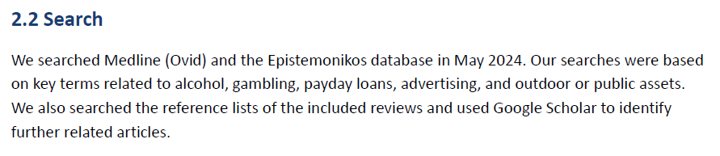

# Searching for and selecting relevant research evidence

Finding research evidence that meets the eligibility criteria is a critical part of the RES process. This section describes a streamlined approach to identifying evidence for inclusion in a RES and provides experience-informed insights and practical tips.

## Learning objectives

By the end of this section, you should:

-   Understand how to develop a search strategy and how to search literature

-   Understand the streamlined approach to study selection

-   Understand the flexible approach to searching for evidence for a RES

For readers who would like an introduction to the literature search and study selection process, please watch the video below.


::: callout-warning
This section does not cover the practical know-how, step-by-step methods, or hands-on skills required to perform literature searches. Searching the literature effectively requires a certain level of skill and experience. Although beginners can undertake searches themselves, it is recommended to seek guidance and support from an experienced librarian wherever possible.

For readers who wish to learn systematic literature search methods, the following resources may be helpful:

-   [Chapter 4: Searching for and selecting studies](#0), in the *Cochrane Handbook for Systematic Reviews of Interventions*.

-   [Cochrane Library User Guide](#0)

-   [PubMed® Online Training](#0)

-   [Video Tutorials](#0) on searching the commonly used databases
:::

## Performing and reporting a search

RES aims to quickly mobilise relevant evidence to support decision-makers on specific health and care innovations. Accordingly, RES searches can be pragmatically flexible and iterative, often prioritising targeted identification of the most relevant, recent and highest-quality evidence, rather than attempting exhaustive retrieval of all potentially related literature.

### Constructing a suitable search strategy

Developing a suitable **search strategy** is important before performing a database search. A search strategy is a structured combination of multiple search terms (i.e., keywords, terms, or phrases) that relate to a review question. These terms are often combined using [Boolean operators]{#boolean title="In literature searches, Boolean operators are specific words (AND, OR and NOT) used to combine or exclude search terms. They improve the relevance of search results" style="color: magenta"}, [truncations]{#truncation title="Truncation involves using a symbol at the end of a term to find all variations of that term. For example, \"surg*\" retrieves 'surgery' and 'surgical.'" style="color: magenta"} and [wildcards]{#wildcard title="Wildcards replace a single letter in a word to retrieve relevant variations of the same word; for instance, \"p?diatric\" can retrieve both 'pediatric' and 'paediatric’" style="color: magenta"}.

The section below outlines key guidance on how to construct a search strategy and present the example strategy we used to identify research for the [ARC-GM RES Restricting advertising in public spaces](files/ARC-GM%20RES%20outdoor%20advertising%20harmful%20commodities.pdf).

::: cr-section
Scroll down to learn key elements to consider when building a search strategy

{#cr-figure2 width="245" height="400"}

@cr-figure2

-   **Identify keywords**

    The first and vital step is to identify keywords that can be combined in a search strategy.

    In identifying keywords, you can:

    -   Consider the topic(s) of the RES question(s);
    -   Identify the main concepts within the question(s) and list relevant keywords. The main concepts of the example include: **outdoor advertising**, **alcohol**, **gambling**, and **payday loan**. The corresponding keywords are in lines **1 to 2**, lines **24 to 36**, lines **7 to 20**, and lines **38 to 42**, respectively.
    -   Check whether a concept has [MeSH]{#mesh title="Medical Subject Headings (MeSH). These are standardised terms used by the U.S. National Library of Medicine to index medical articles in databases like Medline. Using MeSH terms facilitates precise searches for specific health topics." style="color: magenta"} subject headings using databases. Subject headings are standardised terms used for precisely searching literature on a specific topic. For example, **exp Alcohol Drinking/** (line 27), **exp Alcoholic Beverages/** (line 28), **exp Beer/** (line 31), and **exp Wine/** (line 33) are all MeSH subject headings related to the main concept of alcohol. The remaining terms used from line 24 to line 36 are often known as free-text terms.
    -   Refer to key search terms used in the search strategies of published evidence syntheses, usually available within appendices, supplementary materials, and/or in published review protocols. We identified the terms related to the concept 'alcohol' through multiple approaches, including referring to the search terms used in a relevant Cochrane Review [@siegfried2014restricting].
    -   Use databases, Google, or Artificial Intelligence tools (e.g., [litsearchR](#0)) to find other related keywords.

-   **Use Boolean operators to combine search terms appropriately**

    Boolean operators are words (i.e., OR, AND, and NOT) used in search engines and databases to refine and combine search terms. They help to improve search accuracy by controlling how search terms are ‘connected’ with each other in a search.

    1.  OR: This word is used to combine search terms, usually for the same concept, and increases the yield of the search by identifying papers where the terms appear separately or together.
    2.  AND: This word is used to combine different concepts and reduces the yield of the search by only picking papers where the ’AND’ terms all appear (ignoring papers where only one appears).

    Lines 24 to 36 in Figure 2 were combined using the Boolean operator ‘OR’ in line 37 as they are all related to the concept of 'alcohol'.

    Line 45 used the Boolean operator ‘AND’ to combine advertising-related terms and those related to harmful commodities such as alcohol, gambling, and short-term loans.

-   **Refine a search strategy**

    This often includes:

    1.  Rephrasing search terms where relevant e.g., by using truncation and wildcards. For example, \* used in line 24 is a truncation, and the term alcohol\* can retrieve any records containing the word 'alcohol' and other variants such as 'alcoholic'.
    2.  Using pre-defined [search filters]{#filter title="In evidence synthesis, a search filter is a pre-defined combination of search terms. Well-established search filters often have been validated by experts and can optimise literature retrieval based on specific criteria. ISSG Search Filters Resource has a collection of established search filters on various topics." style="color: magenta"} where available (see [ISSG Search Filters Resource](#0) for established search filters on various topics).
:::

### Consideration of appropriate resources of evidence

As a RES often prioritises pre-appraised evidence in the first instance, an efficient approach is to search for systematic reviews and/or other types of reviews in key databases such as Medline (or PubMed) and the Cochrane Library. The [Cochrane Library](https://www.cochranelibrary.com/) includes both the Cochrane Database of Systematic Reviews and the Cochrane Central Register of Controlled Trials (CENTRAL).

When database searching yields insufficient evidence for a RES, you may undertake additional searches using the following resources:

-   [Epistemonikos](#0), a database of systematic reviews in health and care fields.

-   Resources other than databases, including evidence submitted by decision-makers or the manufacturers of an innovation. [NICE guidance](#0) can also be a valuable source of information and should be searched where applicable.

-   Reference checking or forward citation searching of relevant evidence syntheses and primary studies.

When pre-appraised evidence is not available, limited or outdated, and primary studies need to be considered for inclusion in a RES, then further searches can be performed in databases such as Medline, Embase and others as appropriate.

In reporting literature searches, RES reports do not usually present full search strategies and methods (for example, Boolean and proximity operators, subject headings, text words, or limits and filters). Instead, it is often sufficient to provide a **brief description of essential search details**, typically including the **databases and additional resources searched**, the **key concepts**, and the **search dates**, whilst full search strategies are kept available on request. @fig-3 presents an example of the **Search** section from the [ARC-GM RES Restricting advertising in public spaces](files/ARC-GM%20RES%20outdoor%20advertising%20harmful%20commodities.pdf).

{#fig-3}

### Refining the search

As RES searches are allowed to be pragmatically iterative, initial searching can be tightly limited to the evidence directly relevant to the RES questions, i.e., research focusing on the specific health and care innovations and populations that the decision-makers are interested in. When the focused search returns a substantial amount of evidence to address a RES enquiry, wider searches for further evidence may not be needed. If the volume of evidence is unmanageable, or if relevance varies, you may further **refine eligibility criteria** and **limit searches** based on the quality, comprehensiveness, and timeliness of the available evidence.

In cases where the initial searches yield little or no evidence, or even outdated evidence, and you opt to apply wider eligibility criteria as noted in Section 2, further searches can be performed and look for broader, more ***indirect evidence*** that does not perfectly match the specific population, innovation, context, or outcome of interest, but may still provide useful insights.

## Study selection

For a RES, study selection is often performed by a single reviewer to speed up its process, although consultation with a second reviewer is often undertaken. We often use the online tool [Rayyan](https://www.rayyan.ai/) to facilitate the study selection process.

## Section summary

For a RES, you can follow a traditional approach to constructing a search strategy, using Boolean operators to combine search terms, and using commonly used resources to search for evidence.

You can take a flexible approach to searching for evidence for a RES, beginning with a focus on direct evidence and, where necessary, expanding to search for evidence on wider, more indirect evidence.

## Tasks to complete

☐ Search electronic databases and, where applicable, other resources, referring to the [Development and execution of searches](forms/Development%20and%20execution%20of%20searches.docx) document

·       Choose databases and other resources that you consider appropriate for searches

·       Build appropriate search strategies

·       Perform searches

·       Download and manage search results

☐ Screen studies for inclusion against the pre-specified eligibility criteria

☐ Document literature search and selection
