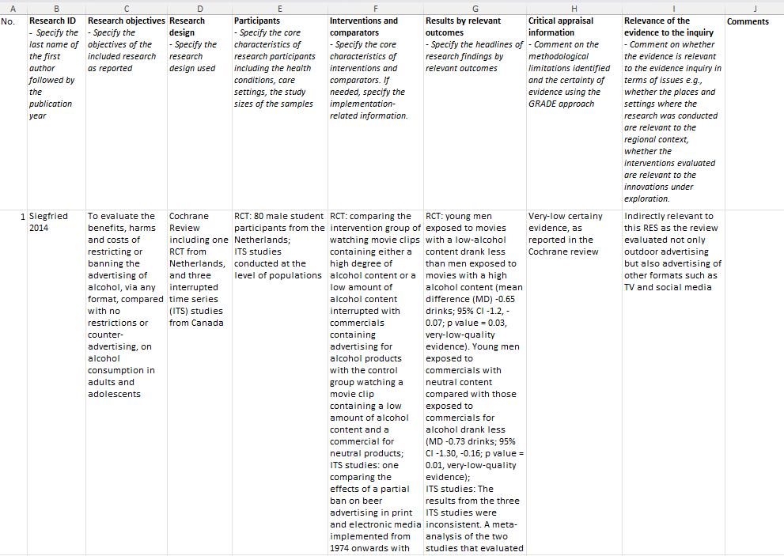

# Synthesising, presenting and communicating the evidence

This section describes how to synthesise the evidence for a RES and outlines the accessible ways of presenting information in the RES to maximise the reach of the findings and their implications.

## Learning objectives

By the end of this section, you should:

-   Understand the narrative approach to synthesising evidence in a RES.

-   Understand how available evidence and assessments of validity and certainty are reported.

-   Understand how to write RES reports using clear and accessible language

## Synthesising the evidence

Normally narrative synthesis is used to report the evidence, mapped to each RES question. Narrative synthesis involves descriptively summarising and interpreting findings across studies. It is a common method when other forms of synthesis (e.g., statistical synthesis) are not possible. For a RES, [meta-analysis]{.d-inline-block tabindex="0" data-bs-toggle="tooltip" title="Meta-analysis is a way of combining the results of several similar studies to get a more strong answer than any single study can provide" style="color: magenta"} is rarely performed or needed, as often RES is to summarise and represent the findings of meta-analyses already reported in the included systematic reviews.

Different types of data (i.e., quantitative or qualitative) are synthesised differently. For narrative syntheses of quantitative data, the summaries of the evidence typically include the following information:

-   The type and quantity of evidence (e.g., the number and type of studies included and their sample sizes),

-   Effect sizes, including average effect sizes and the confidence intervals, or numerical counts of studies that favour an innovation or intervention,

-   The direction of effect sizes, which indicate whether results favour one innovation over another, and the size and meaning of that difference in practical or clinical terms.

The following example shows how the above information is drawn together for a synthesis of quantitative data.

::: cr-section
The [ARC-GM RES Restricting advertising in public spaces](files/ARC-GM RES outdoor advertising harmful commodities.pdf) included four reviews that all present evidence on the impacts of banning alcohol advertising on alcohol assumption behaviour-related outcomes. The right figure shows only data extracted from the Cochrane Review included.

{#cr-data width="1012"}

@cr-data

Narrative methods were used to summarise the data extracted, capturing the following key information:

1.  The type and quantity of evidence:

    In this example, four primary studies were included in the Cochrane Review, of which one was a small RCT with 80 male student participants from the Netherlands, and the others were interrupted time series studies that were conducted among general population in Canada.

2.  Effect sizes, including average effect sizes and the confidence intervals, or numerical counts of studies that favour an innovation or intervention

    In this example, given the certainty of evidence was very low (meaning it is unclear whether the interventions resulted in the effects as reported), the RES did not present the details of effect sizes for brevity.

3.  The direction of effect sizes

    In this example, the meaning and direction of the effect sizes were largely interpreted based on the GRADE assessment results. The very low certainty evidence means it is uncertain whether restricting or banning alcohol advertising reduces alcohol consumption in adults and adolescents.
:::

These summaries of findings can also highlight the methodological limitations of the evidence being presented, as identified in the risk of bias assessment, and also present the level of certainty resulting from the [GRADE]{#grade title="The GRADE framework, which stands for Grading of Recommendations, Assessment, Development, and Evaluations, is globally adopted framework for evaluating the certainty of the conclusions drawn from a body of research evidence. It is widely used by both guideline developers and systematic reviewers" style="color: magenta"} assessments. Incorporating the assessment of the certainty of evidence can help gauge how likely it is that the presented results are close to the truth.

The above example synthesis, along with its related GRADE assessment results and the judgement on the relevance of the evidence to the regional context, results in the summary in @fig5.

{#fig5}

## Presenting a summary of the RES evidence

A RES can present a brief summary of the evidence, like the ‘abstract’ of a systematic review, even when little or no (useful) evidence is identified. Where there are [**multiple RES questions**]{.underline}, the summary can be at a high level, addressing all RES questions in a more concise format (@nte-5).

The Cochrane has a very useful [guidance](https://training.cochrane.org/system/files/uploads/protected_file/GUIDAN~1.PDF#page=8) on writing a plain language summary along with their [template](https://view.officeapps.live.com/op/view.aspx?src=https%3A%2F%2Fwww.cochrane.org%2Fauthors%2Fhandbooks-and-manuals%2Fhandbook%2Fcurrent%2Ftemplate-writing-cochrane-plain-language-summary.docx&wdOrigin=BROWSELINK).

::: {#nte-5 .callout-important}
## Example of evidence summary in the [ARC-GM RES Restricting advertising in public spaces](files/ARC-GM RES outdoor advertising harmful commodities.pdf)

There is some **limited** research evidence regarding the implications of policies that restrict the use of outdoor spaces for advertising alcohol and gambling. We found no research evidence regarding policies to restrict advertising for payday loans.

**Limited** evidence suggests that implementing restrictions on alcohol marketing in outdoor places may reduce the awareness of alcohol advertising in adults, whilst it is **uncertain** if restricting or banning alcohol advertising could reduce alcohol consumption in adults and adolescents. There is **consistent evidence** on the causal relationship between exposure to advertising of gambling commodities and positive attitudes towards gambling, intentions to gamble and increased gambling activity.
:::

## Producing accessible RES reports for knowledge mobilisation

The target audience for a RES is normally policy- or decision-makers who are frequently not research or evidence synthesis experts. The readability of a RES is important, and below outlines some factors that can help you make a RES accessible and user-friendly.

**Clear summaries with user-friendly language and formatting:** When presenting the summary of the evidence, try to consider the language and formatting issues:

-   Using simple language, free of jargon and technical language wherever possible
    -   Where using technical terms cannot be avoided, provide explanations in simple language.
-   Using easy-to-understand statistical information
-   Using visual elements to complement text, such as tables and figures;
    -   Using an easy-to-follow layout with subheadings, bullet points, and a consistent style.

**Concise reporting**: A recommended practice is to keep the summary of the main findings a RES within 1 to 2 pages, in order to efficiently communicate the questions and answers upfront. This summary is followed by the full report, which can be 10 to 20 pages in length as needed. See the examples in @nte-2.

**Objective tone**: A RES presents evidence that helps decision-makers make informed choices about adopting and implementing innovations. The report should be written in an objective tone, focusing solely on the evidence itself. Our practice within the ARC-GM RES team is to refrain from making recommendations about whether to adopt or reject an innovation or intervention because we acknowledge that research evidence is only one of several inputs that inform decision-making.

## Section summary

A RES often uses a narrative approach to synthesise evidence, highlighting the type and quantity of evidence, the size of effect or association, and their clinical or health significance.

The research evidence is summarised across all included studies, and the certainty of evidence needs to be incorporated into the interpretation of RES findings, following a streamlined GRADE approach.

A RES report often begins with a 1–2 page summary, followed by a full report of 10–20 pages. RES findings need to be reported using clear, plain language, and the RES report should be concise to maximise the reach of the findings.

## Tasks to complete

☐ Map and prioritise the included studies to the RES questions; extract sufficient information and summarise the evidence from the included studies.

☐ Present the summary of evidence alongside the certainty of the evidence

☐ Write up a RES report, referring to [examples](https://arc-gm.nihr.ac.uk/rapid-evidence-synthesis) of RES reports

☐ Write a Summary section in a RES report, referring to the Cochrane plain language summary [template](https://view.officeapps.live.com/op/view.aspx?src=https%3A%2F%2Fwww.cochrane.org%2Fauthors%2Fhandbooks-and-manuals%2Fhandbook%2Fcurrent%2Ftemplate-writing-cochrane-plain-language-summary.docx&wdOrigin=BROWSELINK) and [guidance](https://training.cochrane.org/system/files/uploads/protected_file/GUIDAN~1.PDF#page=8)

☐ Check the readability of the RES report
