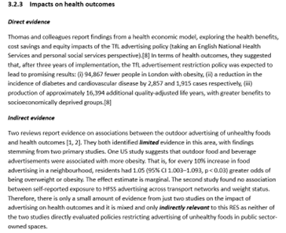

# Synthesising and summarising the evidence

In this section, we describe how to synthesise the evidence for a RES.

## Learning objectives

By the end of this section, you should:

·       Understand the narrative approach to synthesising evidence in a RES.

·       Understand how available evidence and assessments of validity and certainty are reported.

## Presenting key findings of the RES

We normally use narrative synthesis to report the evidence, mapped to each RES question. Narrative synthesis involves descriptively summarising and interpreting findings across studies. It is a common method when other forms of synthesis (e.g., statistical synthesis) are not possible. We rarely perform meta-analysis, but we often summarise meta-analyses that have been reported in the included systematic reviews. Meta-analysis is a way of combining the results of several similar studies to get a more strong answer than any single study can provide.

Different types of data (i.e., quantitative or qualitative) are synthesised differently. For narrative syntheses of quantitative data, our summaries of the evidence typically include the following information:

-   The type and quantity of evidence (e.g., the number and type of studies included and their sample sizes),

-   Effect sizes, including average effect sizes and the confidence intervals, or numerical counts of studies that favour an innovation or intervention,

-   The direction of effect sizes, which indicate whether results favour one innovation over another, and the size and meaning of that difference in practical or clinical terms.

This information is drawn together as in the example in Figure 5 (a synthesis of quantitative data). In this example, information from direct and indirect evidence is presented separately. In some cases, this distinction is just made clear in the summary text.

These summaries of findings can also highlight the methodological limitations of the evidence being presented, as identified in the risk of bias assessment, and also present the level of certainty resulting from the [GRADE]{#grade title="The GRADE framework, which stands for Grading of Recommendations, Assessment, Development, and Evaluations, is globally adopted framework for evaluating the certainty of the conclusions drawn from a body of research evidence. It is widely used by both guideline developers and systematic reviewers" style="color: magenta"} assessments. Incorporating the assessment of the certainty of evidence can help gauge how likely it is that the presented results are close to the truth.

## Presenting a summary of the RES evidence

Each RES presents a brief summary of the evidence presented. Where there are [**multiple RES questions**]{.underline}, we present the evidence summaries across all questions more concisely (@nte-5). This is like the ‘abstract’ of a systematic review.

::: {#nte-5 .callout-note}
## Example of evidence summary in the RES [Restricting advertising in public spaces](https://arc-gm.nihr.ac.uk/media/Resources/ARC/Evaluation/RES/Implementing%20policies%20that%20restrict%20the%20use%20of%20outdoor%20spaces%20for%20advertising%20harmful%20commodities/ARC-GM%20RES%20outdoor%20advertising%20harmful%20commodities%20revised.pdf)

There is some **limited** research evidence regarding the implications of policies that restrict the use of outdoor spaces for advertising alcohol and gambling. We found no research evidence regarding policies to restrict advertising for payday loans.

**Limited** evidence suggests that implementing restrictions on alcohol marketing in outdoor places may reduce the awareness of alcohol advertising in adults, whilst it is **uncertain** if restricting or banning alcohol advertising could reduce alcohol consumption in adults and adolescents. There is **consistent evidence** on the causal relationship between exposure to advertising of gambling commodities and positive attitudes towards gambling, intentions to gamble and increased gambling activity.
:::

## Section summary

In RES reports, we often use a narrative approach to synthesise evidence, highlighting the type and quantity of evidence, the size of effect or association, and their clinical or health significance.

Instead of extracting data using a structured form, we map the included studies to each RES question. When several studies are available for one question, we prioritise those that are most directly relevant, high-quality, comprehensive, and recent. Key information is then extracted and integrated directly into the narrative synthesis.

We summarise the evidence across all included studies and incorporate the certainty of evidence into the interpretation of RES findings, following a streamlined GRADE approach.

## Tasks to complete

☐ Map and prioritise the included studies to the RES questions; extract sufficient information and summarise the evidence from the included studies.

☐ Present the summary of evidence alongside the certainty of the evidence
